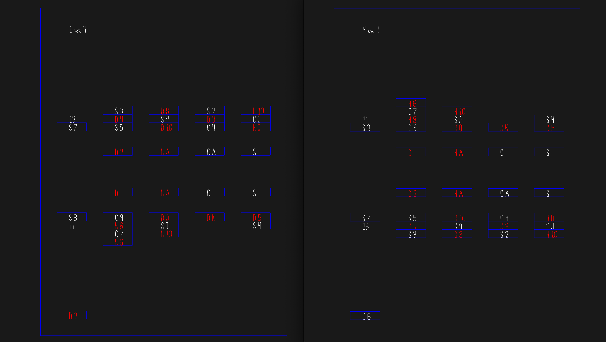

# Socialtaire (Social Solitaire)

Author: Leah Restad

Design:
This game is based off of a version of solitaire that my Grandpa taught me when 
I was young. To this day, my family does not know if my Grandpa made it up, or 
if this is a real version of solitaire, but I have never found it online, so I
know it is unique.

Networking:
The players update their own card piles and scores, but they forward them all
to the server so that the server can determine how to display the information.
The game is multiplayer since one person finishing (either my emptying their
negative pile or my pressing x), will finish the game and calculate the score
for everyone.

Screen Shot:

How To Play:
- The negative pile is in the upper left. It starts with 13 cards, and decreases
to 0. Once one player gets to 0, the game is over, so make sure you are winning
before you use your last card!!
- The positive pile is in the bottom left. You flip 3 cards at a time, and are
only able to access hidden cards by using the cards on top.
- The active piles are the four in the middle/right. To place a card on top,
make sure to alternate colors and use strictly decreasing numbers.
- The suit piles are the four in the middle/top. To place a card on top, make
sure to match suits and use strictly decreasing numbers.

Use the following buttons:
- 0: select the positive pile
- 1: select the negative pile
- 2: select the first active pile
- 3: select the second active pile
- 4: select the third active pile
- 5: select the forth active pile
- 6: select the diamonds pile
- 7: select the hearts pile
- 8: select the clubs pile
- 9: select the spades pile
- x: end the game before your negative pile is empty (only do this if
you are stuck, otherwise it is cheating!)
- space: flips the next three cards in the active pile

Only cards in the suit piles give you points. You can monitor how your competitor
is doing by watching the top of your screen. You can move card to and from
active piles, but only to suit piles, and only from the negative and positive
piles. Enjoy!!! :-D

(Sorry for the messy code - I used stuff to test, then I was going to clean... But then I decided I should start studying for my OS exam tomorrow instead of making my functional code pretty.... :,()

Sources: Just the base code.

This game was built with [NEST](NEST.md).

